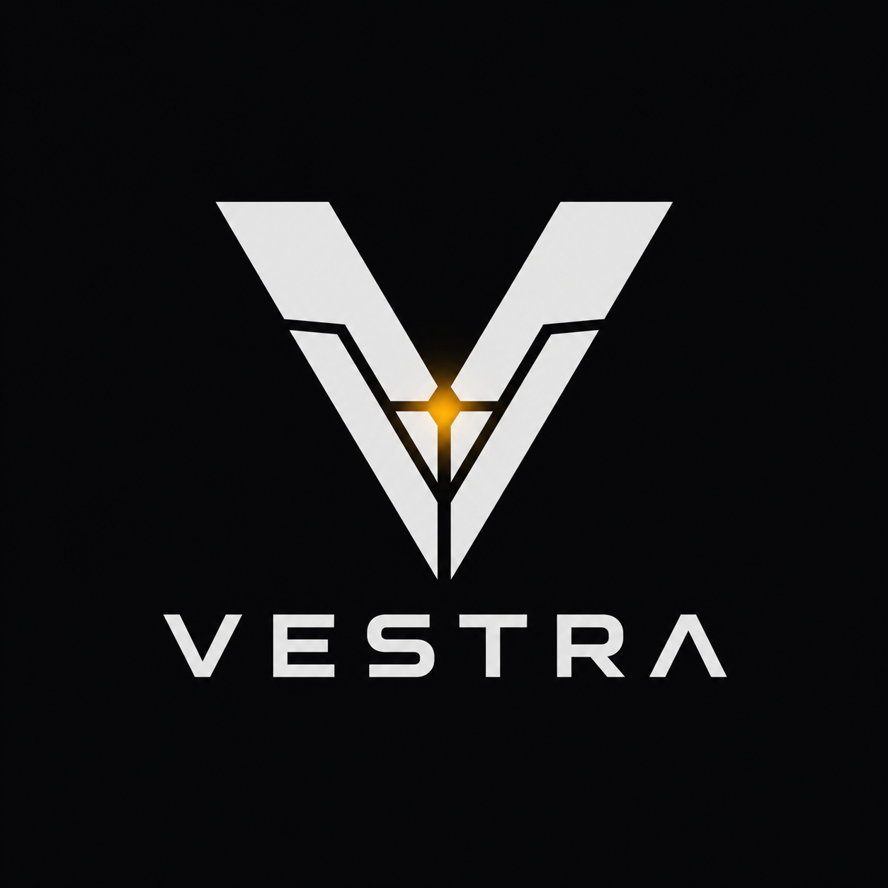
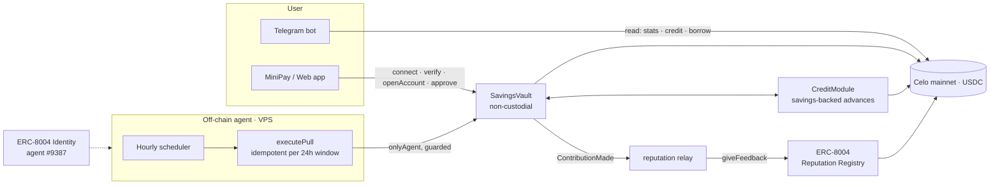

<div align="center">



&nbsp;

[](LICENSE)


### Save small, daily. Build a credit name onchain.

Vestra is an **autonomous savings + credit agent on Celo**. Users commit to a tiny daily save (from $0.10); the agent collects it from a **non‑custodial** vault — it can never touch the principal — writes every on‑time contribution to the **ERC‑8004 Reputation Registry**, and turns that history into a **portable onchain credit identity** that unlocks **savings‑backed advances**. Built for the **15M+ MiniPay users** across emerging markets who already practice daily saving but have no credit record.

**[ Live app ↗ ](https://vestra-six-self.vercel.app)** &nbsp;·&nbsp; **[ Agent on 8004scan ↗ ](https://8004scan.io/agents/celo/9387)** &nbsp;·&nbsp; **[ SavingsVault on Celoscan ↗ ](https://celoscan.io/address/0xf3c25dbd82FE887138B3a589455E4867740a4520)**

</div>

---

## Table of contents

- [The problem](#the-problem)
- [What I built](#what-i-built)
- [Architecture](#architecture)
- [The daily loop, step by step](#the-daily-loop-step-by-step)
- [Smart contracts — the non-custodial safety core](#smart-contracts--the-non-custodial-safety-core)
- [The agent (off-chain orchestrator)](#the-agent-off-chain-orchestrator)
- [How I used Celo, ERC-8004, Self & x402](#how-i-used-celo-erc-8004-self--x402)
- [Engineering decisions & the hard problems](#engineering-decisions--the-hard-problems)
- [Sybil resistance & honest activity](#sybil-resistance--honest-activity)
- [Surfaces: web app + Telegram bot](#surfaces-web-app--telegram-bot)
- [Deployed addresses & verifiable activity](#deployed-addresses--verifiable-activity)
- [Tech stack](#tech-stack)
- [Project layout](#project-layout)
- [Run it locally](#run-it-locally)
- [How it's deployed](#how-its-deployed)
- [Tests](#tests)
- [Status — what's live vs next](#status--whats-live-vs-next)

---

## The problem

Informal savings circles are universal and trusted — **tandas, chamas, susu, paluwagan** — billions of people run them. But they leave you with three failures:

1. **No credit.** You save for years and still have no record a lender can read.
2. **Trust risk.** The collector who holds everyone's money can vanish with it.
3. **Illiquidity.** Your savings are locked in the circle when you need cash.

MiniPay put a stablecoin wallet in 15M+ hands across emerging markets. The missing piece is an agent that turns the daily-saving habit they *already have* into something a lender can trust — **without** asking them to trust a human collector or a custodian.

## What I built

A non-custodial savings + credit agent, live on **Celo mainnet**, with three pillars:

- **Save** — a user grants the `SavingsVault` a capped ERC‑20 allowance once; the agent calls a **guarded `pullContribution`** that can take *at most* the committed daily amount, *at most* once per 24h. The agent never custodies principal and can never move funds to itself.
- **Credit** — every on‑time contribution is written to the **ERC‑8004 Reputation Registry**, building the user's own portable credit identity. Any lender or app on Celo can read it.
- **Borrow** — after building a streak, the user can take a **savings‑backed advance** from the `CreditModule` and repay it; each repayment is another reputation event.

Two surfaces — a **web Mini App** with self‑serve onboarding and a **Telegram bot** — plus an **off‑chain agent** that runs the daily collection autonomously. The agent is registered on ERC‑8004 (**agent #9387** on Celo mainnet, **#361** on Celo Sepolia), and the system has done **real mainnet transactions** end‑to‑end.

## Architecture



The whole system is built around the on‑chain contracts being the source of truth and the **guarded roles** being what guarantees safety — regardless of what the off‑chain agent does.

## The daily loop, step by step

1. **Onboard** (user, once) — connect wallet → verify → **register as your own ERC‑8004 agent** (your credit identity) → `openAccount(dailyAmount)` → grant a capped USDC allowance.
2. **Discover** (agent) — read `AccountOpened` logs to find active savers.
3. **Pull** (agent) — for each saver whose 24h window is open, call `pullContribution(user)`. The contract enforces the cap + window; a double‑pull is a no‑op. Idempotent by design.
4. **Record** (agent) — on a successful contribution, write a reputation event to ERC‑8004 → the user's credit score grows.
5. **Miss handling** — if the allowance/balance is short, the contract records a `Missed` event and resets the streak — it never reverts the batch.
6. **Borrow / repay** (user) — once eligible, request a savings‑backed advance and repay it; both are reputation events.

## Smart contracts — the non-custodial safety core

Two minimal, immutable contracts (Foundry, **22 tests passing**):

| Contract | Role |
|---|---|
| **`SavingsVault`** | Holds each user's principal. `openAccount` / `deposit` / `withdraw` (only un‑locked balance) / guarded `pullContribution` (onlyAgent) / collateral lock‑release‑seize (onlyCreditModule) / pause (onlyGuardian). |
| **`CreditModule`** | `eligibleAmount` / `requestAdvance` (locks collateral) / `repay` (releases it) / `handleDefault` (seizes, bounded by outstanding). |

The invariants the tests pin down — these are what make "an agent pulls money from your wallet daily" *safe*:

- The agent role can **never move funds to itself or an arbitrary address** — the only outward transfers are user `withdraw` and bounded collateral seizure.
- `balance >= lockedCollateral` always.
- **One pull per 24h window**, capped at the committed amount; a double‑pull reverts.
- A missed pull resets the streak instead of reverting.
- Default seizure is **bounded by outstanding** — never over‑seizes.

## The agent (off-chain orchestrator)

A TypeScript service (viem) with a tight, failure‑aware loop: discover accounts → check each account's window → `simulateContract` (skip closed windows for free) → guarded write → relay reputation. It's **network‑configurable** (`NETWORK=mainnet|testnet`), idempotent (the contract's window guard backs it up), and runs continuously under PM2. Reputation writes use the canonical ERC‑8004 `giveFeedback` interface (verified on‑chain).

## How I used Celo, ERC-8004, Self & x402

- **Celo** — deployed to **Celo mainnet (42220)** with **real Circle USDC** as the savings token; gas is cheap and stablecoin‑native, exactly the rails for $0.10 daily saves. (Also runs on Celo Sepolia testnet.)
- **ERC-8004** — used for its *intended* purpose, twice: the **Identity Registry** registers the Vestra agent (**#9387**), and the **Reputation Registry** receives a structured record per contribution/repayment, which is what drives the agent's 8004scan rank *and* gives each user a portable credit identity. Each user registers as their **own** agentId so Vestra (a distinct client) can attest their savings behavior — sidestepping the registry's no‑self‑feedback rule.
- **Self** — proof‑of‑human / sybil resistance. Self Agent ID human‑backs the Vestra agent (ERC‑8004 Proof‑of‑Human extension); see [Status](#status--whats-live-vs-next) for the per‑user verification path.
- **x402** — declared in the agent's registration metadata (`x402Support: true`) as the intended rail for user‑initiated top‑ups/repayments; the recurring daily pull deliberately uses the allowance‑guarded pattern instead (x402 expects the payer to initiate each call).

## Engineering decisions & the hard problems

The interesting work was making *"an agent pulls money from your wallet every day"* something a stranger can trust. A few decisions I'm proud of, and the real problems I hit:

- **The whole design treats "the agent" as the threat to defend against.** Safety isn't a promise in the agent code — it's enforced by the contract. The user grants a *capped* allowance once; `pullContribution` is `onlyAgent` **and** can take at most `dailyAmount`, at most once per 24h window, and has **no path to move funds to the agent or any arbitrary address**. The only outward transfers are the user's own `withdraw` and a bounded collateral seizure. So even a fully-compromised agent key can't drain anyone. That invariant is unit-tested, not assumed.
- **ERC-8004's "no self-feedback" rule forced a better credit model.** I found on-chain that `giveFeedback` *reverts* when an agent rates itself. So instead of Vestra writing reputation "about a user address," **each user registers as their own ERC-8004 agentId**, and Vestra (a distinct client) attests their savings behavior. That's not a workaround — it's the *correct* shape for a **portable, user-owned** credit identity any other lender can read.
- **Celo retired Alfajores mid-build.** The old testnet RPC went `NXDOMAIN` and the faucet started issuing **Celo Sepolia (11142220)** funds. I caught it from a failed RPC call, migrated the entire stack to Sepolia, then deployed to **mainnet (42220)** — both networks are wired and addressed in config.
- **USDC is 6 decimals; cUSD is 18.** The vault is token-agnostic, so going to mainnet was a config change: point it at real Circle USDC and set daily amounts/caps in 6-dp units ($0.10 = `100000`). No contract change, decimals handled at the edges.
- **Idempotent collection.** The agent `simulateContract`s each pull first (closed windows are skipped for free, no gas), and the contract's window guard means a re-run can never double-charge — so the loop is safe to run on any cadence or retry.
- **Load-balanced RPC lag is real.** `forno` round-robins nodes, so a read right after a write can hit a node that hasn't seen the block. Every write path waits for confirmations, polls until state is visible, and pins critical reads to the write's block number — caught and handled, not hoped around.
- **Metadata that actually renders and validates.** 8004scan puts the agent image straight into `og:image`, and browsers can't load `ipfs://` — so the metadata serves the logo over an HTTPS gateway, declares a real **A2A service card on the live domain** at `/.well-known/agent-card.json`, and uses the spec `services` schema (not the deprecated `endpoints`), clearing the registry's validation warning.

## Sybil resistance & honest activity

The hardest thing to fake — and what manual review actually checks — is *one real human per account.* Vestra is built around it:

- **One human, one account.** Onboarding is gated on proof-of-human (Self): **Self Agent ID** human-backs the Vestra agent itself via the ERC-8004 Proof-of-Human extension, and the production sybil gate is **per-user Self ZK passport verification** before `openAccount` (see [Status](#status--whats-live-vs-next)). Each user's credit identity is their own ERC-8004 agentId — so reputation is bound to a verified person, not a throwaway key.
- **Volume designed to survive review.** The unit economics are deliberately tiny ($0.05–0.20/day) so a *real* cohort is cheap to run **and** legitimately sybil-defensible — many small real actions by real people, rather than synthetic volume that reads as farmed. The agent is engineered toward the Work Visa "1,000 unique contract interactions" path (real users × daily saves + repayments), which is the honest way to hit it.

## Surfaces: web app + Telegram bot

- **Web Mini App** (Next.js, live on Vercel) — landing + dashboard with a **self‑serve onboarding wizard** (connect → verify → register → set daily → approve), a **live on‑chain status panel** that reads the mainnet vault/agent directly, a **savings‑backed advance** screen, and a **"vouch for Vestra"** button (writes a real ERC‑8004 feedback to agent #9387).
- **Telegram bot** (no keys held, read‑only) — `/agent` (live saved/savers/vouches), `/credit <address>` (a wallet's verified/streak/balance), `/borrow <address>` (eligibility), `/save` (onboarding link).

## Deployed addresses & verifiable activity

Everything below is **live on mainnet and independently verifiable** — not a testnet-only demo. The system has already run end-to-end on Celo mainnet: the agent pulled a real **USDC contribution** into the vault (onchain activity), and a real **ERC-8004 vouch** was written for agent #9387 (8004scan reputation). The dashboard's live panel reads these numbers straight from the chain; nothing is mocked. Confirm it yourself on [8004scan](https://8004scan.io/agents/celo/9387) and [Celoscan](https://celoscan.io/address/0xf3c25dbd82FE887138B3a589455E4867740a4520).

**Celo mainnet (42220)** — ERC‑8004 agent **[#9387](https://8004scan.io/agents/celo/9387)**

| | Address |
|---|---|
| SavingsVault | [`0xf3c25dbd82FE887138B3a589455E4867740a4520`](https://celoscan.io/address/0xf3c25dbd82FE887138B3a589455E4867740a4520) |
| CreditModule | [`0x24eD128B46e54d3Cb20F33B5b872073f45E61454`](https://celoscan.io/address/0x24eD128B46e54d3Cb20F33B5b872073f45E61454) |
| Token | Circle **USDC** `0xcebA9300f2b948710d2653dD7B07f33A8B32118C` |

**Celo Sepolia (11142220)** — ERC‑8004 agent **361** · SavingsVault `0xab871C4B7DB644f0c447319784662bF9b022811E` · CreditModule `0x4D7ba5c3a2184AA8979AEF251c49ee8bA30A80BB`

## Tech stack

- **Contracts:** Solidity 0.8.28, **Foundry** (forge), 22 unit tests.
- **Agent + scripts:** TypeScript, `tsx`, **viem** — ERC‑8004 registration, the pull orchestrator, the reputation relay, the Telegram bot.
- **Frontend:** Next.js 16, React 19, Tailwind CSS v4, **wagmi + Reown AppKit** for wallet connect, server‑side API routes for the agent‑gated verify step.
- **Chain:** Celo (mainnet + Sepolia), Circle USDC, ERC‑8004 Identity + Reputation registries, IPFS (Pinata) for agent metadata.

## Project layout

```
contracts/                 # Foundry project
  src/
    SavingsVault.sol        # non-custodial vault, guarded daily pull
    CreditModule.sol        # savings-backed advances
    TestUSD.sol             # mintable test stablecoin (testnet only)
    interfaces/             # IERC20, IReputationSink
  test/                     # 22 unit + invariant tests
  script/Deploy.s.sol       # deploy (TOKEN + HARD_CAP configurable)
  deployments/              # celo-mainnet.json, celo-sepolia.json

backend/                    # the off-chain agent (TypeScript)
  src/
    pull.ts                 # daily pull-loop orchestrator
    reputation.ts           # ERC-8004 reputation relay
    onboard.ts              # verification gate (agent setVerified)
    bot.ts                  # Telegram bot
    metadata.ts             # agent metadata builder (IPFS)
    client.ts · abi.ts
  scripts/                  # register-agent, new-agent-wallet, update-metadata,
                            # test-reputation, test-onboard, mainnet-smoke
  lib/                      # erc8004 + contract addresses (per network)

frontend/                   # Next.js Mini App
  src/app/                  # landing, dashboard, /dashboard/onboard, /advance
                            # api/verify (agent-gated), api/onchain (live reads)
  src/components/           # UI, onboarding wizard, advance, vouch, live panel
  src/lib/web3/             # chain config, contracts, ABIs
  public/.well-known/agent-card.json   # A2A service card
```

## Run it locally

**Prerequisites:** Node 20.12+, Foundry, a funded Celo wallet, a Pinata JWT.

```bash
# 1. contracts — test + (optionally) deploy
cd contracts
forge test                                   # 22 passing
PRIVATE_KEY=0x… TOKEN=<usdc> HARD_CAP=50000000 \
  forge script script/Deploy.s.sol:Deploy --rpc-url https://forno.celo.org --broadcast

# 2. agent + scripts
cd ../backend
cp .env.example .env            # PINATA_JWT, AGENT_PRIVATE_KEY, NETWORK=mainnet
npm install
npm run register:mainnet        # register on ERC-8004
npm run pull:loop               # run the daily collection agent
npm run bot                     # run the Telegram bot (needs BOT_TOKEN)

# 3. frontend
cd ../frontend
npm install
# .env.local: NEXT_PUBLIC_REOWN_PROJECT_ID, AGENT_PRIVATE_KEY (server, for /api/verify)
npm run dev                     # http://localhost:3000
```

Useful scripts: `npm run test:reputation` and `npm run test:onboard` prove the reputation + full onboarding flows end‑to‑end on testnet; `npm run smoke:mainnet` runs one real onboarding + contribution + vouch on mainnet.

## How it's deployed

- **Frontend** → **Vercel** (auto‑deploys on push). Needs `NEXT_PUBLIC_REOWN_PROJECT_ID` (wallet connect) and `AGENT_PRIVATE_KEY` (server‑only, for the agent‑gated verify route).
- **Agent + bot** → a **VPS** under **PM2** (`vestra-agent` = `pull:loop`, `vestra-bot` = `bot`), so the daily collection runs 24/7. See `backend/README.md`.
- **Contracts** → Celo **mainnet** + **Sepolia** (addresses above).

## Tests

```bash
cd contracts && forge test     # 22 passed
```

The suite covers the vault invariants (no agent self‑transfer, `balance ≥ locked`, single‑pull‑per‑window, missed‑pull streak reset), the credit math (eligibility, collateral lock/release, default seizure bounded by outstanding), and the access‑control guards. The reputation + onboarding flows are additionally proven live on‑chain via the `test:*` and `smoke:mainnet` scripts.

## Status — what's live vs next

Built to be honest about maturity:

- ✅ **Live & real:** mainnet contracts + agent #9387, the autonomous pull orchestrator, ERC‑8004 reputation writes (both directions), self‑serve onboarding, the advance flow, the Telegram bot, a real end‑to‑end mainnet transaction.
- 🔜 **Next:** full **per‑user Self ZK passport verification** as the onboarding sybil‑gate (today the gate is agent‑attested; Self Agent ID human‑backs the agent itself), an **x402** top‑up/repayment path, a funded `CreditModule` liquidity pool for live advances, and a real saver cohort for sustained volume.

---

<div align="center">
Built for the <b>Celo Onchain Agents Hackathon</b> · Save small, daily — build a credit name onchain.
</div>
